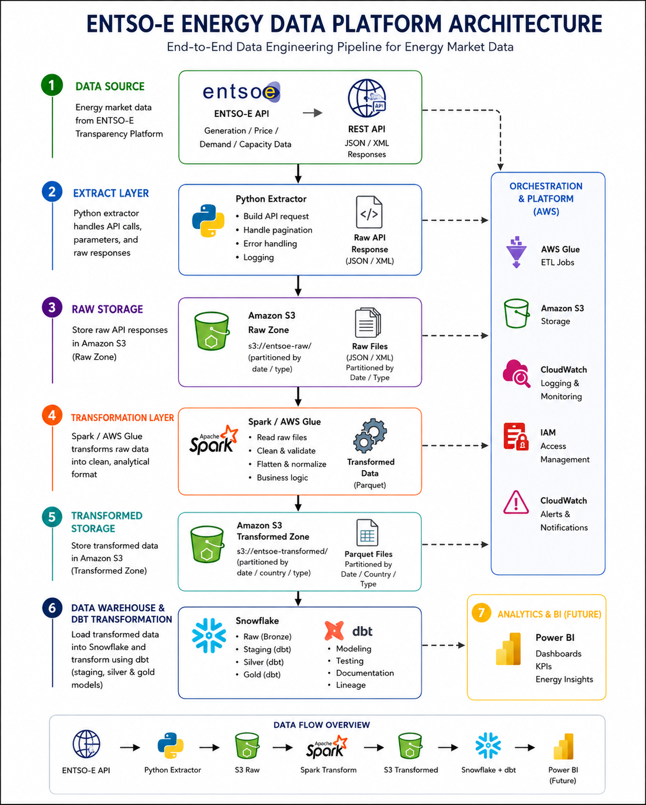
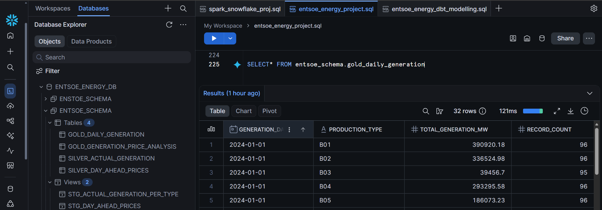
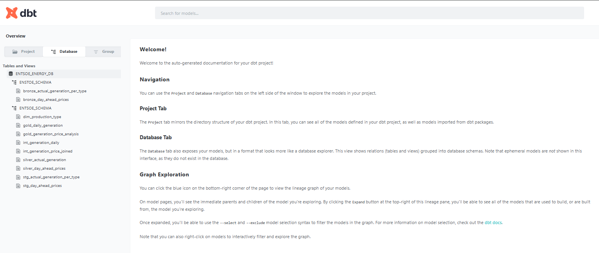
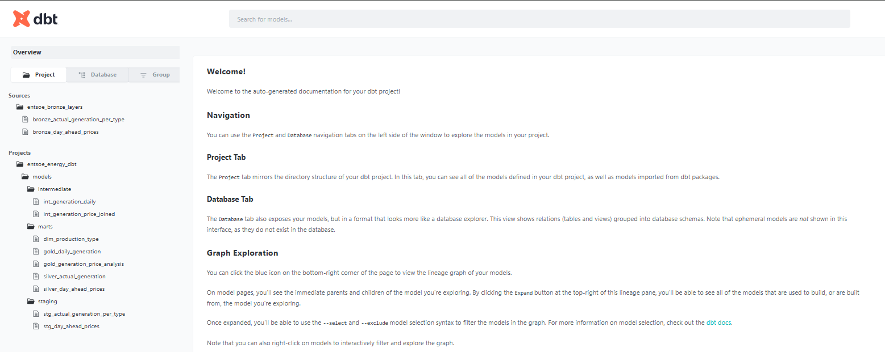
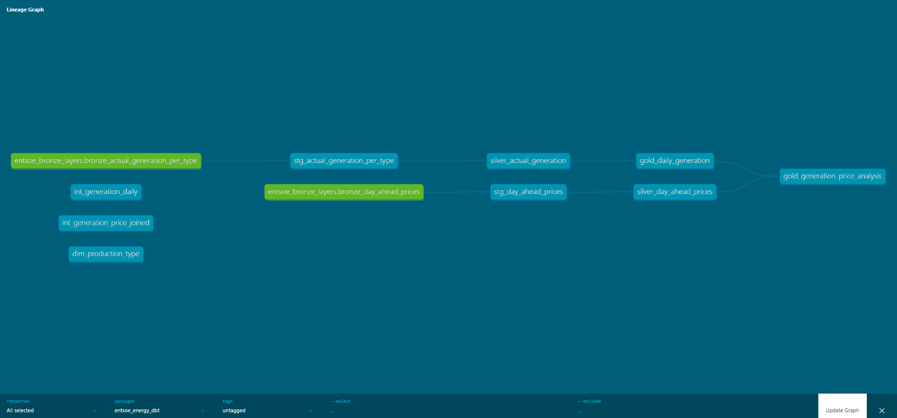

# ENTSO-E Energy Data Platform

An end-to-end cloud-native energy data engineering platform built using Python, AWS, Airflow, Snowflake, dbt, Docker, and GitHub Actions.

The platform extracts electricity market data from the ENTSO-E Transparency Platform API, stores raw data in Amazon S3, performs Spark-based transformations, orchestrates workflows with Apache Airflow, and models analytical datasets in Snowflake using dbt staging, silver, and gold layers.

The project demonstrates modern data engineering practices including:
- medallion data architecture
- orchestration
- automated testing
- CI/CD pipelines
- dbt lineage & documentation
- Docker containerization
- cloud-native storage & transformation workflows

# ENTSO-E Energy Data Platform Architecture




# ENTSO-E Energy Data Platform

This project is an end-to-end data engineering pipeline that extracts electricity market data from the ENTSO-E API, stores raw data in AWS S3, and orchestrates the workflow using Apache Airflow.

The project is designed as a portfolio-grade energy data platform and will be extended with Spark/Glue transformations, Snowflake modelling, dbt, and Power BI analytics.

## Project Goals

- Extract energy data from the ENTSO-E Transparency Platform API
- Store raw API responses in AWS S3
- Orchestrate the pipeline with Apache Airflow
- Build a scalable foundation for Spark transformations
- Prepare data for Snowflake, dbt modelling, and Power BI dashboards

## Pipeline Flow

1. Extract ENTSO-E market data via API
2. Store raw JSON data in AWS S3
3. Orchestrate workflows using Apache Airflow
4. Transform data using Spark
5. Load transformed data into Snowflake
6. Build analytics dashboards in Power BI

## Current Architecture

ENTSO-E API
   ↓
Python Extract Layer
   ↓
AWS S3 Raw Zone
   ↓
Apache Airflow Orchestration

## Planned Architecture

ENTSO-E API
   ↓
Airflow DAG
   ↓
S3 Raw Zone
   ↓
Spark / AWS Glue Transformation
   ↓
S3 Transformed Zone
   ↓
Snowflake
   ↓
dbt Models
   ↓
Power BI Dashboard

## Tech Stack
-Python
-Apache Airflow 3
-Docker
-CeleryExecutor
-Redis
-PostgreSQL
-AWS S3
-Git / GitHub

## Planned additions:
-dbt
-Power BI
## Project Structure

## Project Structure

```text
entso_e_energy_pipeline/
│
├── dags/
│   └── entsoe_energy_dag.py
│
├── src/
│   └── entsoe_e_pipeline/
│       ├── config.py
│       ├── extract.py
│       ├── load.py
│       ├── pipeline.py
│       ├── logger.py
│       └── exceptions.py
│
├── docs/
│   └── architecture.md
│
├── tests/
│   └── test_extract.py
│
├── transform/
│   └── glue_transform_generation.py
│
├── .github/
│   └── workflows/
│       └── ci.yml
│
├── docker-compose.yml
├── requirements.txt
├── requirements-dev.txt
├── pytest.ini
├── .gitignore
└── README.md
```

# Airflow Orchestration

The pipeline is orchestrated using Apache Airflow with the CeleryExecutor.

Airflow services include:

-Airflow API server
-Airflow scheduler
-Airflow DAG processor
-Airflow worker
-Redis broker
-PostgreSQL metadata database

The DAG currently executes one main task:

-extract_and_load_entsoe_data_to_s3

This task calls the Python pipeline, extracts ENTSO-E data, and uploads the raw response to AWS S3.

## Running the Project

### Start Airflow with Docker Compose:

-docker compose up -d

### Open Airflow UI:

-http://localhost:8080

### Trigger the DAG:

-entsoe_energy_pipeline

## Environment Variables

### Example:

ENTSOE_API_KEY=your_api_key
AWS_ACCESS_KEY_ID=your_access_key
AWS_SECRET_ACCESS_KEY=your_secret_key
AWS_REGION=eu-central-1
AWS_BUCKET_NAME=your_bucket_name
PREFIX=raw/entsoe
FERNET_KEY=your_fernet_key

- The .env file is excluded from Git.

## Current Status

Completed:

-Python extraction layer
-S3 loading layer
-Logging and exception handling
-Dockerized Airflow setup
-Airflow DAG registration
-CeleryExecutor configuration
-Successful DAG execution
-GitHub version control

## Newly Implemented Components

### Spark / AWS Glue Transformation Layer
Implemented Spark-based transformation logic using AWS Glue to clean, normalize, and process ENTSO-E energy market data.

### Parquet Transformation Output
Transformed datasets are written in optimized Parquet format for efficient analytical processing and scalable storage.

### Snowflake Ingestion & Data Warehouse
Implemented Snowflake ingestion pipeline with bronze, silver, and gold data layers for analytical modelling.

### Snowflake Silver Layer Output



### dbt Transformation & Testing Layer
Implemented dbt staging, silver, and gold models with automated testing, documentation, and lineage tracking.

### dbt Project Documentation



### dbt Database Overview



### dbt Lineage Graph



The lineage graph below illustrates the dependency flow between staging, silver, and gold dbt models within the ENTSO-E analytical warehouse architecture.


### CI/CD Pipeline
Implemented GitHub Actions CI pipeline for automated testing, formatting checks, and Docker image validation.

### Power BI Dashboard (Planned)
Future implementation of Power BI dashboards for energy market analytics and visualization.

